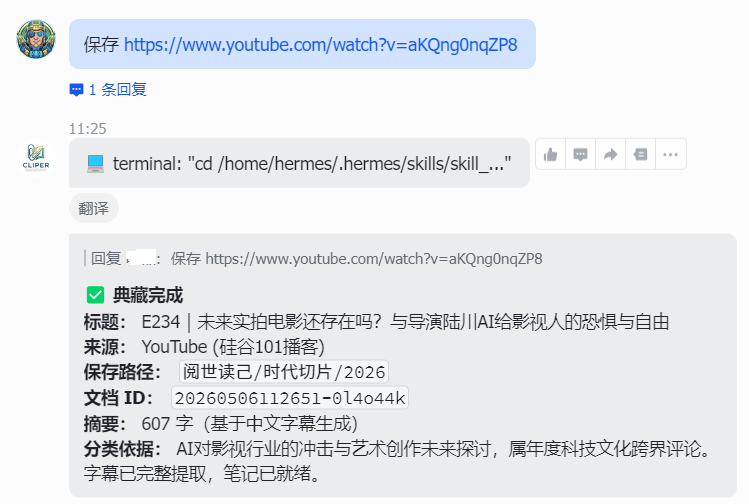
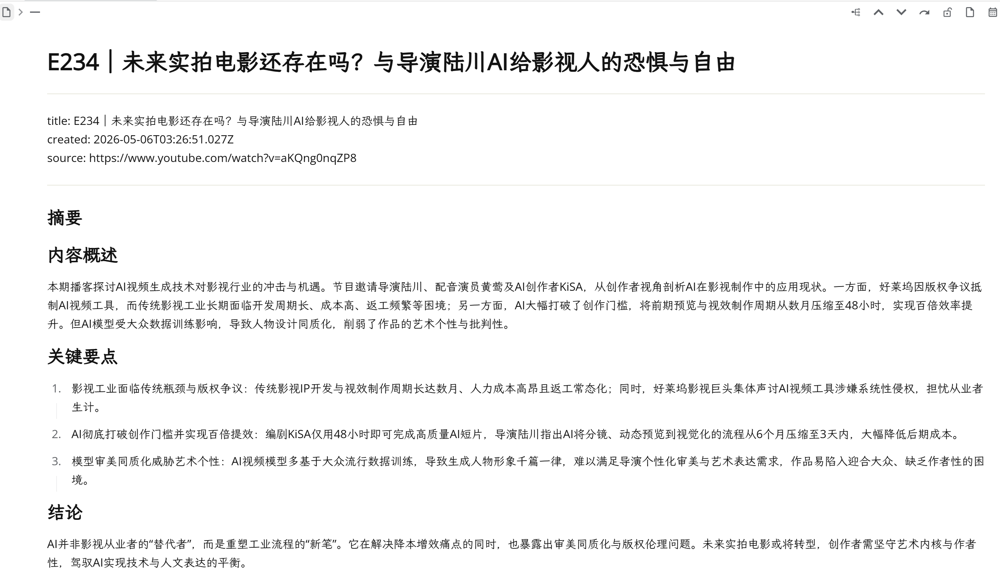

# 思源智能典藏

**为智能体提供的自动内容剪存工具**

当智能体（OpenClaw、Hermes Agent 等）接收到保存指令时，自动处理：
- **网页文章**：知乎、微信公众号、通用网页 - 抓取正文并生成摘要
- **视频内容**：B站、YouTube - 提取视频信息并生成摘要
- **本地图片**：上传图片并生成智能描述

所有内容自动分类到合适的思源笔记本路径。

## 安装

```bash
# 1. 复制到智能体的skills目录
cp -r skill_siyuan_full_clipper ~/.openclaw/skills/

# 2. 安装依赖
cd ~/.claude/skills/skill_siyuan_full_clipper
npm install

# 3. 配置 config.json（见下一节）
```

## 配置

创建 `config.json`，配置思源、LLM API 和临时目录：

```json
{
  "siyuan": {
    "api": "http://localhost:6806",
    "token": "你的思源token"
  },
  "llm": {
    "baseUrl": "https://openrouter.ai/api/v1",
    "apiKey": "你的API密钥",
    "model": "anthropic/claude-3-haiku"
  },
  "tempDownloadDir": "/tmp/siyuan_clipper"
}
```

`tempDownloadDir`：用于下载网页文件并转换，每次典藏完成后自动清除。

环境变量可覆盖：`SIYUAN_API`、`SIYUAN_TOKEN`、`LLM_BASE_URL`、`LLM_API_KEY`、`LLM_MODEL`

## 使用方式

### 初始化

首次使用时，告诉智能体初始化这个skill：

```
用户: 初始化skill_siyuan_full_clipper这个skill
智能体: [读取skill.md] → [执行npm install] → [设置cron定时任务] → "初始化完成"
```

智能体会自动完成：
- 读取 skill.md 了解触发条件和执行方式
- 安装 Node.js 依赖
- 设置定时任务（可选）

### 保存内容

向智能体发送保存指令，智能体自动调用：

```
用户: 保存这篇文章 https://zhuanlan.zhihu.com/p/123456
智能体: [自动调用skill] → 内容抓取 → 生成摘要 → 分类保存 → "已保存到思源笔记本"
```

支持的关键词：保存、收藏、典藏、存下来、摘录、save、bookmark

### 使用示例




## 前置条件

- 思源笔记运行中，API 可访问
- 智能体已安装并配置此skill
- LLM API可用

初始化时智能体会自动完成：
- 运行 `scripts/utils/export.js` 导出思源笔记本目录结构（生成 `categories.json`）
- 设置定时任务清理临时文件